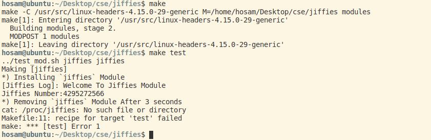

# Kernal 

this file to index what i need for implementing the Kernal task
<br>

## Preparation

```bash
$ sudo apt update 
```


```bash
$ sudo apt install gcc  
```


```bash
$ sudo apt install build-essitial
```

## commands
<br>

for showing log messages

```bash
$ dmesg 
```

Add module to kernal
```bash
$ insmod [file].ko
```

List modules in kernal
```bash
$ lsmod 
```

Remove modules from kernal
```bash
$ rmmod
```

## Errors & Fixes

- First time i run `make` command i ran into an error


__solution__
> sudo apt install libelf-dev


## WORK 

1.  **kernal1**


1.  **Jiffies**


